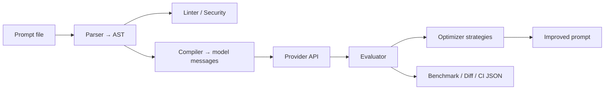

# OpenPrompt

**The open-source prompt optimizer.**

Analyze. Optimize. Evaluate. Benchmark.

OpenPrompt treats prompts like **code**: parse them into a structured AST, lint for quality issues, optimize with evaluation-driven strategies, and prove improvements with test suites — all from the CLI, Python SDK, REST API, or web dashboard.

> **Note:** This project is unrelated to [THUNLP/OpenPrompt](https://github.com/thunlp/OpenPrompt) (prompt-learning for fine-tuning). The PyPI name `openprompt` is taken; install from source until a release name is chosen.

## Quick start

Five commands from clone to your first optimized prompt — no API key required (uses the built-in `mock` provider):

```bash
git clone https://github.com/openprompt/openprompt.git && cd openprompt
pip install -e .

openprompt lint examples/summarize/prompt.txt          # offline quality check
openprompt eval examples/summarize                       # run bundled tests
openprompt optimize examples/summarize \
  --tests examples/summarize/tests.yaml                  # improve prompt (~5–6 mock calls)
```

**Next steps:**

```bash
openprompt init --project my-app                         # scaffold your own project
openprompt eval examples/summarize --json                # JSON output for CI

# Real model (set your provider key first)
export OPENAI_API_KEY=sk-...
openprompt optimize examples/summarize \
  --tests examples/summarize/tests.yaml \
  --provider openai --model gpt-4o-mini \
  --output optimized.txt
```

See [Clone and install](#clone-and-install) for venv setup and optional extras (`[openai]`, `[server]`, `[media]`).

---

## Table of contents

- [Quick start](#quick-start)
- [What is OpenPrompt?](#what-is-openprompt)
- [How it works](#how-it-works)
- [Clone and install](#clone-and-install)
- [First run after cloning](#first-run-after-cloning)
- [Project layout](#project-layout)
- [CLI reference](#cli-reference)
- [Optimization strategies](#optimization-strategies)
- [Evaluation metrics](#evaluation-metrics)
- [Configuration](#configuration)
- [Providers](#providers)
- [Python SDK](#python-sdk)
- [REST API](#rest-api)
- [Web dashboard](#web-dashboard)
- [Extraction datasets (PDF / images)](#extraction-datasets-pdf--images)
- [Test suite formats](#test-suite-formats)
- [Plugins](#plugins)
- [Development](#development)
- [License](#license)

---

## What is OpenPrompt?

Most teams store prompts as plain text in repos, tweak them by hand, and hope they still work. OpenPrompt gives you a **repeatable engineering workflow** for prompts:

| Stage | What OpenPrompt does |
|-------|----------------------|
| **Parse** | Turn `.txt` or `.yaml` prompts into a structured **Prompt AST** (roles, output format, RAG, tools, media, security rules) |
| **Lint** | Offline checks for ambiguity, contradictions, missing output format, vague instructions |
| **Evaluate** | Run labeled test cases against a model; score with exact match, regex, JSON schema, semantic similarity, or LLM judge |
| **Optimize** | Search for better prompts using strategies from fast reinforcement loops (~5–6 API calls) to full evolutionary search |
| **Benchmark** | Compare multiple prompt variants side-by-side with cost, latency, and accuracy |
| **Version** | Save, diff, and regression-test prompt versions like source files |
| **Secure** | Scan for injection patterns, leaked secrets, and missing untrusted-input isolation |

**Who it's for:** engineers building LLM features who want CI-friendly prompt tests, measurable improvements, and optional local-only run history (SQLite — no telemetry by default).

**What it's not:** a hosted prompt manager, a fine-tuning framework, or a replacement for your LLM provider. It orchestrates **your** models and **your** test data.

---

## How it works



1. **Input:** `prompt.txt`, `prompt.yaml`, or a task directory (`prompt.txt` + `tests.yaml`).
2. **AST:** Structured intermediate representation (schema v1.1) with objective, constraints, output spec, examples, RAG, agent tools, and media attachments.
3. **Offline tools:** `lint`, `inspect`, `security`, `diff` — no API key required.
4. **Online tools:** `eval`, `optimize`, `benchmark`, `compare` — call a model provider (or `mock` for smoke tests).
5. **Output:** Terminal tables, JSON for CI, saved YAML/text files, SQLite run logs, or REST/dashboard UI.

---

## Clone and install

### Prerequisites

- **Python 3.11+** (3.12 recommended)
- **Git**
- Optional: **Node.js 18+** for the web dashboard
- Optional: provider API keys (OpenAI, Anthropic, Gemini, Grok, OpenRouter) or [Ollama](https://ollama.com) for local models

### Steps

```bash
# 1. Clone the repository
git clone https://github.com/openprompt/openprompt.git
cd openprompt

# 2. Create a virtual environment (recommended)
python -m venv .venv

# On Windows (PowerShell)
.\.venv\Scripts\Activate.ps1

# On macOS / Linux
source .venv/bin/activate

# 3. Install OpenPrompt in editable mode
pip install -e .

# 4. Verify the CLI
openprompt --version
openprompt --help
```

### Optional extras

```bash
# All model providers
pip install -e ".[all-providers]"

# Individual providers
pip install -e ".[openai]"      # OpenAI
pip install -e ".[anthropic]"     # Anthropic Claude
pip install -e ".[gemini]"        # Google Gemini
pip install -e ".[grok]"          # xAI Grok

# Semantic similarity metric (sentence-transformers)
pip install -e ".[semantic]"

# PDF/image extraction (pypdf, Pillow)
pip install -e ".[media]"

# REST API server (FastAPI + Uvicorn)
pip install -e ".[server]"

# Development (pytest, ruff, mypy, pre-commit)
pip install -e ".[dev,server]"
```

### Environment variables (when using real models)

| Variable | Used by |
|----------|---------|
| `OPENAI_API_KEY` | `openai` provider |
| `ANTHROPIC_API_KEY` | `anthropic` provider |
| `GOOGLE_API_KEY` or `GEMINI_API_KEY` | `gemini` provider |
| `XAI_API_KEY` | `grok` provider |
| `OPENROUTER_API_KEY` | `openrouter` provider |
| `OLLAMA_HOST` | `ollama` provider (default `http://localhost:11434`) |
| `OPENPROMPT_API_KEY` | REST server auth (`openprompt serve`) |

Without any API key, use `--provider mock` for heuristic scoring and smoke tests.

---

## First run after cloning

Run these commands from the repo root with your venv activated:

```bash
# Offline — no API key needed
openprompt lint examples/summarize/prompt.txt
openprompt inspect examples/summarize/prompt.txt
openprompt security examples/summarize/prompt.txt

# Evaluate with bundled tests (mock provider — no API key)
openprompt eval examples/summarize

# Optimize with mock provider (fast smoke test)
openprompt optimize examples/summarize --tests examples/summarize/tests.yaml --strategy reinforcement

# Scaffold your own project
openprompt init --project my-app --path ./my-app
cd my-app
openprompt lint prompts/example/prompt.txt
openprompt eval prompts/example
```

**With a real model:**

```bash
export OPENAI_API_KEY=sk-...   # or set in openprompt.yaml

openprompt eval examples/summarize --provider openai --model gpt-4o-mini
openprompt optimize examples/summarize \
  --tests examples/summarize/tests.yaml \
  --strategy reinforcement \
  --provider openai \
  --model gpt-4o-mini \
  --output optimized.txt
```

**JSON output for CI:**

```bash
openprompt eval examples/summarize --json
openprompt lint examples/summarize/prompt.txt --json
openprompt optimize examples/summarize --tests examples/summarize/tests.yaml --json
```

---

## Project layout

After cloning:

```
openprompt/
├── openprompt/           # Python package (CLI, core engine, providers, server)
│   ├── cli/              # Typer CLI entry point
│   ├── core/             # AST, parser, linter, optimizer, evaluator, benchmark
│   ├── providers/        # OpenAI, Anthropic, Gemini, Ollama, mock, …
│   ├── server/           # FastAPI REST API
│   ├── sdk/              # Public Python SDK (OpenPrompt client)
│   └── templates/        # Built-in prompt templates
├── examples/             # Ready-to-run task examples
├── benchmarks/           # Benchmark fixtures and results
├── dashboard/            # Next.js web UI
├── tests/                # Pytest suite
├── plugins/example/      # Sample plugin package
├── pyproject.toml
└── openprompt.yaml       # Optional project config (create with `openprompt init`)
```

After `openprompt init`:

```
my-app/
├── openprompt.yaml
├── prompts/
│   └── example/
│       ├── prompt.txt
│       └── tests.yaml
├── tests/
└── evaluators/
```

**Task directory convention:** a folder with `prompt.txt` (or `.yaml`) plus `tests.yaml`, `tests.json`, or `tests.csv`. Commands like `openprompt eval examples/summarize` auto-discover both files.

---

## CLI reference

Global flags (all commands):

| Flag | Description |
|------|-------------|
| `--help` | Show command help |
| `--version`, `-V` | Print version (`openprompt 0.3.0`) |

---

### `openprompt init`

Scaffold a new OpenPrompt project.

```bash
openprompt init
openprompt init --project invoice-bot --path ./invoice-bot
```

| Option | Default | Description |
|--------|---------|-------------|
| `--project`, `-p` | `my-project` | Project name in `openprompt.yaml` |
| `--path` | `.` | Directory to initialize |

**Creates:** `openprompt.yaml`, `prompts/example/prompt.txt`, `prompts/example/tests.yaml`, `tests/`, `evaluators/`.

---

### `openprompt lint`

Offline prompt quality analysis. No API key required.

```bash
openprompt lint examples/summarize/prompt.txt
openprompt lint examples/code-review.yaml --json
```

| Argument / option | Description |
|-------------------|-------------|
| `prompt` | Path to `.txt`, `.yaml`, or `.yml` prompt file |
| `--json` | Machine-readable output for CI |

**Checks:** ambiguous phrases, vague verbs, contradictory instructions, missing output format, overly long prompts, empty sections, and more. Returns a heuristic score 0–100.

---

### `openprompt inspect`

Parse a prompt and display its AST. Offline.

```bash
openprompt inspect examples/summarize/prompt.txt
openprompt inspect examples/code-review.yaml --format json
openprompt inspect examples/summarize/prompt.txt --format text
```

| Option | Default | Description |
|--------|---------|-------------|
| `--format`, `-f` | `yaml` | Output: `yaml`, `json`, or `text` (rendered prompt) |

---

### `openprompt eval`

Run a test suite against a prompt using a model provider.

```bash
# Task directory (auto-finds prompt + tests)
openprompt eval examples/summarize

# Explicit paths
openprompt eval examples/summarize/prompt.txt --tests examples/summarize/tests.csv

# Regression check against a baseline
openprompt eval examples/summarize \
  --baseline examples/summarize/prompt.txt \
  --fail-on-regression

# Real model + JSON for CI
openprompt eval examples/summarize \
  --provider openai --model gpt-4o-mini --json
```

| Argument / option | Description |
|-------------------|-------------|
| `target` | Prompt file **or** task directory |
| `--tests`, `-t` | Path to test suite (YAML/JSON/CSV) |
| `--provider` | Override model provider from config |
| `--model` | Override model name |
| `--baseline` | Baseline prompt for regression comparison |
| `--fail-on-regression` | Exit code 1 if score/tokens regress |
| `--json` | JSON report (accuracy, pass_rate, cost, per-test results) |

Logs runs to `.openprompt/runs.db` when `privacy.storage: local` in config.

---

### `openprompt optimize`

Improve a prompt using an optimization strategy.

```bash
# Default strategy (reinforcement) with tests
openprompt optimize examples/summarize --tests examples/summarize/tests.yaml

# Deep search (many API calls)
openprompt optimize examples/summarize \
  --tests examples/summarize/tests.yaml \
  --strategy hybrid

# Save result
openprompt optimize examples/summarize \
  --tests examples/summarize/tests.yaml \
  --output optimized.txt

# Specific provider
openprompt optimize examples/classification \
  --strategy reinforcement \
  --provider ollama --model llama3.2
```

| Argument / option | Description |
|-------------------|-------------|
| `prompt` | Prompt file or task directory |
| `--strategy`, `-s` | Strategy name (see [Optimization strategies](#optimization-strategies)) |
| `--tests` | Test suite path (strongly recommended for meaningful scores) |
| `--provider`, `--model` | Model overrides |
| `--output`, `-o` | Save optimized prompt (`.txt` or `.yaml`) |
| `--json` | JSON with scores, tokens, cost, candidates |

Prints a results table (score, tokens, cost delta), top candidates, failure analysis, and the recommended prompt.

---

### `openprompt compress`

Reduce token count while preserving quality. Uses the `compress` strategy internally.

```bash
openprompt compress examples/summarize/prompt.txt
openprompt compress examples/summarize/prompt.txt -o compressed.txt
openprompt compress examples/summarize/prompt.txt --provider openai --model gpt-4o-mini
```

---

### `openprompt benchmark`

Evaluate multiple prompts in a directory and produce a ranked report.

```bash
openprompt benchmark benchmarks/summarize/
openprompt benchmark benchmarks/classification/ --output report.md
openprompt benchmark my-prompts/ --provider mock
```

| Option | Description |
|--------|-------------|
| `--output`, `-o` | Write Markdown report (+ `.json` alongside) |
| `--provider`, `--model` | Model overrides |

---

### `openprompt compare`

A/B compare two prompts on the same test suite.

```bash
openprompt compare \
  prompts/v1.txt prompts/v2.txt \
  examples/summarize/tests.yaml

openprompt compare prompt_a.yaml prompt_b.yaml tests.json \
  --provider openai --model gpt-4o-mini
```

Prints accuracy, tokens, cost, and deltas for each prompt.

---

### `openprompt security`

Offline security scan. No API key required.

```bash
openprompt security examples/summarize/prompt.txt
openprompt security my-prompt.yaml --json
openprompt security my-prompt.txt --fail-on-findings   # CI gate
```

**Detects:** prompt injection patterns, jailbreak language, markup injection, hardcoded API keys/secrets, missing isolation for untrusted user content.

---

### `openprompt diff`

Diff two prompt files or two saved versions.

```bash
# Compare two files
openprompt diff prompts/v1.txt prompts/v2.txt

# Compare version labels in a version directory
openprompt diff v1 v2 --dir prompts/versions
```

---

### `openprompt save`

Save a prompt as a versioned YAML snapshot.

```bash
openprompt save examples/summarize/prompt.txt v1
openprompt save optimized.txt v2 --dir prompts/summarize/versions
```

---

### `openprompt template`

Print or copy a built-in starter template.

```bash
openprompt template summarization
openprompt template code_review -o my-prompt.yaml
openprompt template classification
openprompt template extraction
```

Available templates: `summarization`, `code_review`, `classification`, `extraction`.

---

### `openprompt multi-model`

Optimize the same prompt across multiple provider/model pairs.

```bash
openprompt multi-model examples/summarize \
  -m openai:gpt-4o-mini \
  -m anthropic:claude-3-5-haiku-20241022 \
  -m ollama:llama3.2 \
  --tests examples/summarize/tests.yaml \
  --strategy reinforcement
```

| Option | Description |
|--------|-------------|
| `--model`, `-m` | Repeatable `provider:model` pairs (falls back to `models:` in `openprompt.yaml`) |
| `--strategy`, `-s` | Optimization strategy |
| `--tests`, `-t` | Test suite path |

Shows a comparison table with best quality and lowest cost picks.

---

### `openprompt cost-recommend`

Run optimization and recommend the best quality/cost tradeoff using Pareto analysis.

```bash
openprompt cost-recommend examples/summarize --strategy rewrite
openprompt cost-recommend examples/summarize --min-quality 0.9
openprompt cost-recommend examples/summarize --provider openai --model gpt-4o-mini
```

---

### `openprompt tune`

Bayesian-style tuning of optimizer hyperparameters (`eval_budget`, `max_iterations`, etc.), then optimize with suggested settings.

```bash
openprompt tune examples/summarize --trials 20
openprompt tune examples/summarize --trials 30 --strategy hybrid
```

---

### `openprompt serve`

Start the REST API server.

```bash
pip install -e ".[server]"

# Local dev (no auth)
openprompt serve

# With API key auth
export OPENPROMPT_API_KEY=your-secret
openprompt serve --api-key your-secret --host 0.0.0.0 --port 8000

# Hot reload
openprompt serve --reload
```

| Option | Default | Description |
|--------|---------|-------------|
| `--host` | `127.0.0.1` | Bind address |
| `--port` | `8000` | Port |
| `--reload` | `false` | Auto-reload on code changes |
| `--api-key` | env `OPENPROMPT_API_KEY` | Require `X-API-Key` header |

**Docs:** `http://127.0.0.1:8000/docs`

---

### `openprompt dataset init`

Scaffold a PDF/image extraction dataset.

```bash
pip install -e ".[media]"

openprompt dataset init --name invoice --path datasets/invoice
# Add files to datasets/invoice/samples/ and labels/*.json
```

Creates `dataset.yaml`, `samples/`, `labels/`, `example_pool.yaml`, and a starter prompt.

---

### `openprompt dataset eval`

Evaluate an extraction prompt against labeled documents.

```bash
openprompt dataset eval datasets/invoice/dataset.yaml \
  --prompt prompts/invoice/prompt.yaml

openprompt dataset eval datasets/invoice/dataset.yaml \
  --prompt prompts/invoice/prompt.yaml \
  --provider openai --model gpt-4o-mini --json
```

---

### `openprompt dataset optimize`

Optimize a prompt for structured extraction on your dataset.

```bash
openprompt dataset optimize datasets/invoice/dataset.yaml \
  --prompt prompts/invoice/prompt.yaml \
  --strategy extraction

# Vision models — attach sample media
openprompt dataset optimize datasets/invoice/dataset.yaml \
  --prompt prompts/invoice/prompt.yaml \
  --vision \
  --output prompts/invoice/optimized.yaml
```

See [examples/extraction-dataset/README.md](examples/extraction-dataset/README.md) for a full walkthrough.

---

## Optimization strategies

| Strategy | API calls (typical) | Best for |
|----------|---------------------|----------|
| `reinforcement` **(default)** | ~5–6 | Fast, test-driven rewrites; good default |
| `rewrite` | 1–2 | Single-shot LLM rewrite |
| `iterative` | Medium | Repeated small improvements |
| `evolutionary` | High | Population search with crossover + NSGA-II |
| `hybrid` | High | Evolutionary + bandit operator selection |
| `compress` | Low–medium | Token reduction with quality floor |
| `few_shot` | Medium | Inject examples from an example pool |
| `rag` | Medium | RAG-aware prompt mutations |
| `agent` | Medium | Agent/tool-calling prompts |
| `grpo` | Medium | Group-relative policy optimization style proposals |
| `extraction` | Medium | Structured JSON extraction from documents |

Configure defaults in `openprompt.yaml`:

```yaml
optimizer:
  strategy: reinforcement
  eval_budget: 100          # max eval calls for evolutionary/hybrid
  reinforcement_rounds: 2
  few_shot_count: 3
  parallel_workers: 4
```

**Tip:** Always pass `--tests` for strategies that claim accuracy improvements. Without tests, optimization falls back to lint + security heuristics only.

---

## Evaluation metrics

Each test case specifies a `metric`:

| Metric | Description | Requires |
|--------|-------------|----------|
| `exact_match` | Normalized string equality | `expected` |
| `contains` | Output contains substring | `expected` |
| `regex` | Pattern match | `pattern` |
| `json_schema` | Validate JSON output against schema | `schema` |
| `semantic` | Embedding similarity | `expected`, `pip install -e ".[semantic]"` |
| `llm_judge` | LLM rubric scoring | Judge config in `openprompt.yaml` |
| `custom` | Plugin or Python evaluator | `evaluator` name or custom module |

Example test (YAML):

```yaml
tests:
  - name: valid_json
    input: "Invoice from Acme, total $120"
    metric: json_schema
    schema:
      type: object
      required: [vendor, total]
      properties:
        vendor: { type: string }
        total: { type: number }

  - name: mentions_remote
    input: "Article about remote work trends."
    metric: contains
    expected: remote

  - name: quality_check
    input: "Summarize this paragraph."
    metric: llm_judge
    expected: "Concise bullet summary"
```

---

## Configuration

Create `openprompt.yaml` with `openprompt init` or hand-author:

```yaml
project: my-project

model:
  provider: mock          # mock | openai | anthropic | gemini | grok | ollama | openrouter
  name: mock-model
  temperature: 0.7
  max_tokens: 4096

# Optional: default list for multi-model command
models:
  - provider: openai
    model: gpt-4o-mini
  - provider: ollama
    model: llama3.2

optimizer:
  strategy: reinforcement
  eval_budget: 100
  max_iterations: 5
  reinforcement_rounds: 2
  few_shot_count: 3
  auto_tune: false

meta_model:               # Used by GRPO proposer
  provider: openai
  model: gpt-4o-mini

evaluation:
  pass_threshold: 0.85
  holdout_ratio: 0.0      # fraction of tests held out during optimization
  min_test_count: 3
  custom_evaluator: null  # path to Python evaluator module
  judge:                  # optional LLM judge
    provider: openai
    model: gpt-4o-mini
    rubric: null

objectives:
  quality_weight: 1.0
  token_weight: 0.3
  cost_weight: 0.2

regression:
  min_score_delta: -0.05  # allow 5% score drop max
  max_token_increase: 0.25

privacy:
  telemetry: false
  storage: local          # local | none
  db_path: .openprompt/runs.db

server:
  api_key: null
  cors_origins:
    - http://localhost:3000
  rate_limit_per_minute: 120
```

OpenPrompt walks up from the current directory to find `openprompt.yaml`. CLI flags override config values.

---

## Providers

| Provider | Install extra | Environment variable | Notes |
|----------|---------------|----------------------|-------|
| `mock` | built-in | — | Heuristic scores; smoke tests, no API key |
| `ollama` | built-in | `OLLAMA_HOST` | Local models |
| `openrouter` | built-in | `OPENROUTER_API_KEY` | Multi-model gateway |
| `openai` | `.[openai]` | `OPENAI_API_KEY` | GPT models, vision |
| `anthropic` | `.[anthropic]` | `ANTHROPIC_API_KEY` | Claude models |
| `gemini` | `.[gemini]` | `GOOGLE_API_KEY` | Gemini models, vision |
| `grok` | `.[grok]` | `XAI_API_KEY` | xAI Grok |

```bash
openprompt eval examples/summarize --provider openai --model gpt-4o-mini
openprompt optimize examples/summarize --provider gemini --model gemini-2.0-flash
openprompt eval examples/summarize --provider ollama --model llama3.2
```

---

## Python SDK

```python
from openprompt import OpenPrompt, ModelSpec

# Offline lint (no provider calls for parse/lint)
client = OpenPrompt(provider="mock")
report = client.lint("Summarize this article in bullet points.")
print(report.score, report.issues)

# Evaluate
eval_report = client.evaluate(
    "examples/summarize",
    tests="examples/summarize/tests.yaml",
)
print(eval_report.accuracy, eval_report.pass_rate)

# Optimize
result = client.optimize(
    "examples/summarize",
    strategy="reinforcement",
    tests_path="examples/summarize/tests.yaml",
)
print(result.prompt)
print(f"Score: {result.original_score:.1%} → {result.optimized_score:.1%}")

# Compress
compressed = client.compress("examples/summarize/prompt.txt")

# Security scan
sec = client.security_scan("examples/summarize/prompt.txt")

# Multi-model
from openprompt import ModelSpec
mm = client.multi_model_optimize(
    "examples/summarize",
    models=[
        ModelSpec(provider="openai", model="gpt-4o-mini"),
        "ollama:llama3.2",
    ],
    tests_path="examples/summarize/tests.yaml",
)
print(mm.to_markdown_table())

# Cost/quality recommendation
rec = client.recommend_cost_quality(result, min_quality=0.85)
print(rec.recommended, rec.reason)

# Extraction datasets
eval_report = client.dataset_eval(
    "Extract vendor and total as JSON.",
    "datasets/invoice/dataset.yaml",
)
opt = client.dataset_optimize(
    "prompts/invoice/prompt.yaml",
    "datasets/invoice/dataset.yaml",
    strategy="extraction",
    vision=True,
)
```

**SDK methods:**

| Method | Description |
|--------|-------------|
| `lint(prompt)` | Offline quality analysis → `LintReport` |
| `security_scan(prompt)` | Offline security scan → `SecurityReport` |
| `evaluate(prompt, tests=...)` | Run test suite → `EvalReport` |
| `optimize(prompt, strategy=..., tests_path=...)` | Optimize → `OptimizeResult` |
| `compress(prompt)` | Token compression → `OptimizeResult` |
| `benchmark(paths, tests_dir=...)` | Multi-prompt benchmark → `BenchmarkReport` |
| `multi_model_optimize(prompt, models, ...)` | Cross-provider optimize → `MultiModelOptimizeResult` |
| `recommend_cost_quality(result, min_quality=...)` | Pareto pick → `CostRecommendation` |
| `dataset_eval(prompt, dataset_path)` | Extraction eval → `EvalReport` |
| `dataset_optimize(prompt, dataset_path, vision=...)` | Extraction optimize → `OptimizeResult` |

---

## REST API

```bash
pip install -e ".[server]"
export OPENPROMPT_API_KEY=your-secret   # optional but recommended
openprompt serve --api-key your-secret
```

Interactive docs: **http://127.0.0.1:8000/docs**

| Endpoint | Method | Description |
|----------|--------|-------------|
| `/health` | GET | Version and status (no auth) |
| `/lint` | POST | Lint a prompt |
| `/evaluate` | POST | Run test suite |
| `/optimize` | POST | Optimize prompt |
| `/compress` | POST | Compress tokens |
| `/benchmark` | POST | Benchmark prompts |
| `/multi-model/optimize` | POST | Multi-model optimization |
| `/cost/recommend` | POST | Cost/quality recommendation |
| `/dataset/eval` | POST | Extraction dataset eval (multipart) |
| `/dataset/optimize` | POST | Extraction dataset optimize (multipart) |

Send header `X-API-Key: your-secret` on all endpoints except public paths (`/health`, `/docs`, …).

**Dataset upload example:**

```bash
curl -X POST http://127.0.0.1:8000/dataset/eval \
  -H "X-API-Key: your-secret" \
  -F 'prompt=Extract vendor and total as JSON.' \
  -F 'provider=mock' \
  -F 'labels={"invoice.pdf":"{\"vendor\":\"Acme\",\"total\":120}"}' \
  -F 'schema={"type":"object","properties":{"vendor":{"type":"string"}}}' \
  -F 'files=@samples/invoice.pdf'
```

OpenAPI spec: [openapi.json](openapi.json) (regenerate with `python scripts/export_openapi.py`).

---

## Web dashboard

A Next.js UI in `dashboard/` for lint, evaluate, optimize, benchmark, multi-model, and extraction datasets — no CLI required.

```bash
# Terminal 1 — API
pip install -e ".[server]"
openprompt serve

# Terminal 2 — Dashboard
cd dashboard
npm install
cp .env.example .env.local   # optional
npm run dev
```

Open **http://localhost:3000**. Configure API URL and keys in **Settings**.

For browser CORS:

```bash
# Windows PowerShell
$env:OPENPROMPT_CORS_ORIGINS="http://localhost:3000"
openprompt serve

# macOS / Linux
export OPENPROMPT_CORS_ORIGINS=http://localhost:3000
openprompt serve
```

See [dashboard/README.md](dashboard/README.md) for details.

---

## Extraction datasets (PDF / images)

For “optimize a prompt to extract structured data from my documents”:

```bash
pip install -e ".[media]"

openprompt dataset init --name invoice --path datasets/invoice
# 1. Add PDFs/images to datasets/invoice/samples/
# 2. Add expected JSON to datasets/invoice/labels/ (optional; also inline in dataset.yaml)

openprompt dataset eval datasets/invoice/dataset.yaml \
  --prompt prompts/invoice/prompt.yaml

openprompt dataset optimize datasets/invoice/dataset.yaml \
  --prompt prompts/invoice/prompt.yaml \
  --strategy extraction \
  --vision
```

See [examples/extraction-dataset/README.md](examples/extraction-dataset/README.md).

---

## Test suite formats

Evaluate and optimize accept **YAML**, **JSON**, or **CSV**.

**YAML** (recommended):

```yaml
tests:
  - name: summary_has_bullets
    input: "Long article text…"
    metric: contains
    expected: "-"
```

**JSON** — array or `{ "tests": [...] }`:

```json
[
  { "input": "Long article text…", "expected": "remote", "metric": "contains" },
  { "name": "non_empty", "input": "Short text.", "pattern": ".{10,}", "metric": "regex" }
]
```

**CSV** — header row with at least `input`; optional `name`, `expected`, `metric`, `pattern`:

```csv
name,input,expected,metric
t1,"Article about remote work.",remote,contains
t2,"Another input.",expected text,exact_match
```

**Examples in repo:**

```
examples/
├── summarize/
│   ├── prompt.txt
│   ├── tests.yaml
│   ├── tests.json
│   └── tests.csv
├── classification/
│   ├── prompt.txt
│   └── tests.yaml
├── code-review.yaml
└── extraction-dataset/README.md
```

---

## Plugins

Extend OpenPrompt with entry points in your own PyPI package:

| Entry point group | Purpose |
|-------------------|---------|
| `openprompt.operators` | Mutation operators |
| `openprompt.evaluators` | Custom test metrics |
| `openprompt.strategies` | Custom optimization strategies |

See [plugins/example/](plugins/example/) for a standalone plugin template.

Built-in demo plugins ship with the package (`clarity` operator, `contains` evaluator, `passthrough_rewrite` strategy).

---

## Development

```bash
git clone https://github.com/openprompt/openprompt.git
cd openprompt
python -m venv .venv && source .venv/bin/activate   # or Windows equivalent
pip install -e ".[dev,server]"

# Run tests (requires ≥50% coverage)
pytest

# Lint
ruff check openprompt

# Refresh OpenAPI spec
python scripts/export_openapi.py

# Pre-commit (optional)
pre-commit install
```

CI runs on Python 3.11 and 3.12: ruff, pytest, offline lint/eval smoke tests, and OpenAPI export verification.

---

## License

Apache-2.0 — see [LICENSE](LICENSE).

## Documentation

- [PRD.md](PRD.md) — product requirements and roadmap
- [dashboard/README.md](dashboard/README.md) — web UI setup
- [examples/extraction-dataset/README.md](examples/extraction-dataset/README.md) — document extraction walkthrough
- [benchmarks/README.md](benchmarks/README.md) — benchmark fixtures
